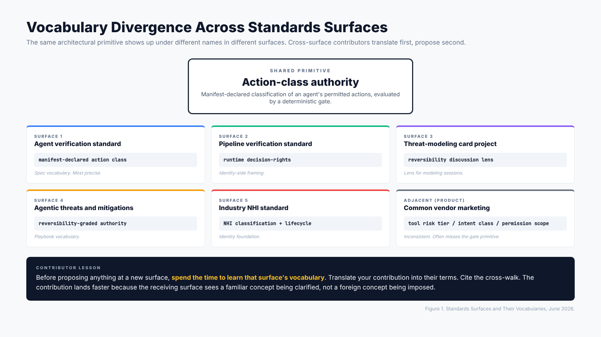
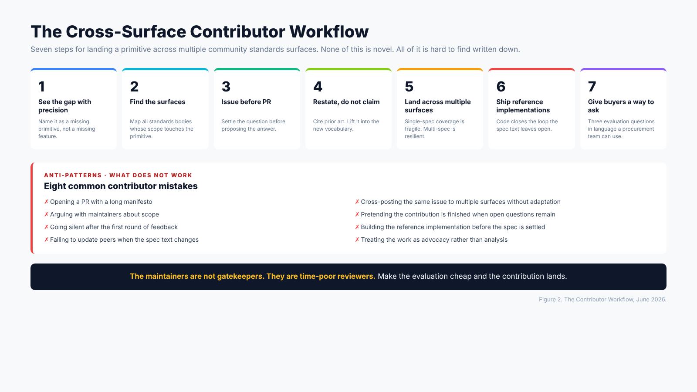

# What I Learned Contributing Across Five Standards Surfaces in Five Months

  *Five months of community standards work on agentic AI security: maintainer dynamics, vocabulary, issue-before-PR, prior art, reference
  implementations.*

**Date**: June 2, 2026
**Author**: Mayur Agnihotri
**Reading time**: ~9 minutes

## TL;DR

Working on the same architectural primitive across five community standards surfaces in roughly five months produced a small set of observations that are worth writing down. Maintainers are not gatekeepers, they are time-poor reviewers. Vocabulary divergence between surfaces is the silent killer of cross-surface contributions. Issue-before-PR is the rule that prevents most contributor pain. Reference implementations close the loop in a way that pure spec contributions never do. Prior art citation makes contributions easier to land, not harder. This essay is a reflection on what works, what does not, and what I would do differently if I were starting now.

---

## Why write this down

The agentic AI security space is full of contributors who want to help and do not know where to start. Most of them have done the technical homework. Most of them have something real to contribute. What is missing is the working method of community standards contribution, which is a different skill from the technical work that produces the contribution in the first place.

I wrote this essay because the working method is hard-won and rarely taught. The maintainer communities of the surfaces I have worked on do not have onboarding documentation that covers the social and process side of contributing. Each surface assumes you already know how to contribute and tells you only what is specific to that surface. The general method is implicit, picked up by osmosis after a few cycles of trying and failing.

What follows is a compression of five months of trying. None of it is novel. All of it is hard to find written down in one place.

---

## Observation 1: Maintainers are not gatekeepers, they are time-poor reviewers

The most common contributor mental model is that maintainers stand between contributions and the spec. This is wrong. The maintainers I have worked with are people who care about the project, do the work in their evenings or as a fraction of a day job, and have a backlog longer than they can clear. They are not screening you. They are triaging their own time.

The implication for the contributor is that you should make the maintainer's evaluation cheap. A well-framed issue takes ten minutes to read and respond to. A poorly-framed issue takes thirty minutes plus three follow-up questions. Multiply this by the queue depth and you can see why ten well-framed contributions get attention before a hundred poorly-framed ones.

What "well-framed" means in practice:

- One topic per issue. Multi-topic issues sit indefinitely because they require multi-topic responses.
- Existing scope acknowledged. If your issue touches existing spec text, quote it. If it does not, say what new scope you are proposing.
- A concrete proposal, not a vague concern. "Consider whether the spec should address X" is harder to act on than "I propose adding requirement X.Y.Z with the following text."
- Prior art cited. Maintainers can evaluate restatements faster than they can evaluate inventions.
- Open questions called out explicitly. If the proposal has a part you are unsure about, name it. Pretending the proposal is finished when it is not slows the review.

The maintainer is not your adversary. The maintainer is the person trying to keep the project moving while you are trying to add to it. Frame your contribution to make their job easier and you will see your contributions land faster.

---

## Observation 2: Vocabulary divergence between surfaces is the silent killer

The same architectural primitive often shows up in two or three standards surfaces under different names. The action-class authority that one spec calls "manifest-declared action class" another spec might call "intent classification" or "operation type" or "tool risk tier." Each surface has its own vocabulary, often inherited from the surface's history.

This matters for the contributor because if you bring vocabulary from one surface into another surface, two things happen. First, the maintainers of the receiving surface have to translate your contribution into their existing vocabulary before they can evaluate it. That increases the review cost. Second, the contribution may seem to overlap with existing work that is using different terms for the same thing, and the maintainers may close it as duplicate even when it is not.

The fix is to spend the time to read the receiving surface's existing terminology before proposing anything. Identify the term the surface uses for the concept you are bringing. Restate your contribution using their term. Cite your source surface for the cross-walk. The contribution lands more easily because the receiving surface sees a familiar concept being clarified, not a foreign concept being imposed.

This is also true in reverse. When you build a reference implementation, name your variables, functions, and config keys in the vocabulary of the surface you are pairing with. Do not invent your own naming scheme. If the spec calls it "action class," the variable should be `action_class`, not `risk_level` or `permission_tier`. The naming discipline pays back in reviewer time saved.

*Figure 1. The same architectural primitive shows up under different vocabularies in different surfaces. Cross-surface contributors have to translate before they can contribute.*

---

## Observation 3: Issue-before-PR is sacred

This is the rule that prevents most contributor pain. An issue is a question for the maintainer community. A PR is a proposed answer. If you open a PR without an issue, you are asking the community to evaluate your answer to a question they have not agreed is the right question. The PR review then becomes a conversation about whether the question is worth asking, which is much harder to have than a conversation about whether the answer is good.

I have made this mistake. In the first month, I opened a PR with the spec text I wanted to land. The maintainers did not engage with the spec text. They engaged with whether the concept was worth landing at all. The PR sat for two weeks. Eventually, on advice from a more experienced contributor, I closed the PR and opened an issue with the conceptual question. The discussion in the issue resolved the question in three days, and then a new PR with refined text was reviewed in another two days.

The total elapsed time was less with issue-first, even though it required two artifacts instead of one. The reason is that the issue did the cheap work (deciding whether the concept lands) and the PR did the expensive work (deciding whether the text is good). When you skip the issue, the PR ends up doing both jobs, and the cheap work delays the expensive work.

The rule has subtle benefits beyond the time savings. The issue surfaces objections that the PR alone would not. Other contributors weigh in with related work the maintainers might not have remembered. The maintainers can express tentative preferences without committing to spec text. By the time the PR is opened, the bar it has to clear is lower because the concept is already settled.

The rule has one common exception. If the change is purely editorial (typo, broken link, formatting), the issue is not needed because there is no conceptual question. Editorial PRs can land directly. Anything that touches the spec's logic should go through an issue first.

---

## Observation 4: Reference implementations are the missing link

Spec text is a contract. Reference implementations are the existence proof that the contract is implementable.

Without a reference implementation, a spec contribution is at risk of being aspirational. The text describes something that should exist, but no one has built it. Future implementers either skip the requirement entirely or implement it inconsistently because the spec text leaves ambiguity that only running code would have exposed.

With a reference implementation, the spec text becomes load-bearing. Implementers see what compliance looks like. The reference surfaces ambiguities in the spec that pure prose would have missed. Maintainers can point to the reference when explaining the spec to confused readers. Buyers can ask vendors whether their product behaves like the reference, and the question becomes answerable.

The reference does not need to be production-grade. It needs to be:

- Small enough to read in an afternoon.
- Testable, with a test suite that exercises the spec's claims.
- Permissively licensed, so vendors and other implementers can study it.
- Versioned, so changes track the spec's evolution.
- Honest about what it does not implement.

I have shipped two reference implementations alongside spec work this year. Both took roughly a week of evening time to build to first publication. Both have already been useful in maintainer conversations as concrete examples. The cost is small. The payback is large.

The hardest part of building a reference is restraint. The temptation is to ship a full implementation with all the production concerns (signing, audit logging, persistence, scalability, observability). Resist this. The reference's job is to demonstrate the spec, not to be a product. Strip everything that is not load-bearing for the spec's claims. Document what is omitted. Move on.

---

## Observation 5: Prior art citation makes contributions easier to land, not harder

The common contributor anxiety is that citing prior art will make their contribution look derivative and reduce their credit. The opposite is true. Citing prior art makes the contribution look serious and reduces the maintainer's review burden.

Maintainers have seen many contributions framed as novel that were not novel. They have to spend time verifying the novelty claim before they can evaluate the contribution. A contribution that opens with "this restates [prior work] in modern vocabulary" is faster to evaluate because the maintainer does not have to do the novelty audit. The contributor is doing that work for them.

The cost to the contributor is essentially zero. The credit for restating a primitive in a new vocabulary, in the right specs, at the right time, is real. It is not the same kind of credit as inventing the primitive, but it is the kind of credit that gets the work into the standards, which is what most contributors actually want.

Specific prior art that comes up in the agentic AI security space:

- **Capability-based security.** The 1966 paper by Dennis and Van Horn, the 1984 book by Levy, the lineage of object-capability systems. The action-class authority idea is, in part, capability-based security applied to agentic actions.
- **Transactional database theory.** The ACID guarantees, particularly atomicity and durability, treat reversibility as a first-class architectural property. The chain rule for composed actions has analogues in transaction semantics.
- **Formal verification of safety-critical systems.** Envelope-based actuation limits in aerospace and industrial control predate the entire field of agentic AI. The "the agent cannot reach the gate" principle is borrowed.
- **Operating system access control.** Discretionary versus mandatory access control, capability tokens, principal authentication, audit trails. Most of these patterns translate directly to the agent context.
- **Compiler and verification literature.** Type systems that classify operations by side-effect class are a useful precedent for the action class concept.

If you are about to contribute a primitive, ask whether any of the above already covers it. Usually one or more do. Cite them.

---

## Observation 6: Land it across multiple surfaces, not just one

A primitive that exists only in one spec is fragile. The spec's editorial cycle can change. The maintainer community can churn. The scope can drift. A primitive that exists consistently across three or four specs has resilience because no single spec's evolution can erase it.

The cost of cross-surface contribution is high. Each surface has its own vocabulary, review cadence, and maintainer culture. Spending the time to land the same primitive in multiple surfaces is patient work. But it is the work that actually changes the architectural floor.

The way I have approached this in practice:

- Identify the primitive precisely. Write it down for yourself first.
- Identify the surfaces whose scope touches the primitive. For agentic AI security, this is currently around five surfaces.
- For each surface, do the vocabulary translation. What term does this surface use for the concept?
- File an issue at the surface that is most active. Get the concept settled there.
- Once settled at one surface, file matching issues at the others, citing the first surface's settled version. This lets the other surfaces see the concept has been validated and reduces their independent evaluation cost.
- Build a reference implementation that is consistent with the settled spec text. The reference becomes the cross-surface bridge.

This process is slow. The first cycle takes weeks. The second and third surfaces go faster because the first surface's discussion has already done the conceptual work.

*Figure 2. The workflow I converged on. See the gap, identify surfaces, issue before PR, restate not claim, land across multiple surfaces, ship a reference, give buyers a way to ask.*

---

## Anti-patterns I see contributors make

Five months of watching contributors (including myself) try things produced a list of what does not work.

**Anti-pattern 1: Opening a PR with a long manifesto.** The maintainer reads the first paragraph, sees a long PR, and defers. Long manifestos in PRs do not land. Long manifestos in essays land. Pick the right venue.

**Anti-pattern 2: Cross-posting the same issue to multiple surfaces without adaptation.** Each surface has its own vocabulary and scope. A copy-pasted issue reads as low-effort and gets closed.

**Anti-pattern 3: Arguing with maintainers about scope.** If a maintainer says the project's scope does not include the contribution, the contribution does not belong there, regardless of how good the contribution is. Argue about scope and you will lose. Find a different surface that fits the scope.

**Anti-pattern 4: Pretending the contribution is finished when it has open questions.** Maintainers will find the open questions during review. If you flagged them yourself in the issue, you look thorough. If they found them, you look unprepared.

**Anti-pattern 5: Going silent after the first round of feedback.** Contributions are conversations. Going silent for a week and then asking why nothing happened is not how the conversation moves. Respond promptly to feedback. Acknowledge what you accepted, push back politely on what you did not, and ask for clarification on what you did not understand.

**Anti-pattern 6: Building the reference implementation before the spec is settled.** Build the spec first. Then build the reference. The other order produces a reference whose details do not match the final spec text.

**Anti-pattern 7: Failing to update peers when the spec text changes.** If you are working with peers on a cross-surface contribution and the spec text at one surface changes, tell the others. They are running on the version they last saw.

**Anti-pattern 8: Treating the work as advocacy.** Standards work is not advocacy. The work is to figure out what the right primitive is and land it correctly. If you are emotionally attached to a specific phrasing or a specific scope, you will lose when the maintainers ask you to change it. Stay calm. Iterate. The primitive matters. The phrasing is fungible.

---

## What I would do differently if starting now

If I were beginning this work today instead of five months ago, three changes would have saved time.

**First, I would map all the relevant surfaces before opening any issues.** Five months ago I started at one surface, got a contribution landed, then went looking for the next. The result was that I learned each surface's vocabulary the hard way, by making vocabulary mistakes. Starting with a map of the surfaces would have meant fewer wrong terms in early issues.

**Second, I would build the reference implementation earlier, in parallel with the spec text.** Five months ago I waited until the spec contribution was nearly settled before starting the reference. The result was that the reference surfaced ambiguities in the spec late, requiring revision rounds. Building the reference in parallel would have surfaced the ambiguities during the spec discussion, when revisions are cheap.

**Third, I would write more in public, earlier.** The essay you are reading now is a synthesis of five months of working. Writing it down earlier, even in shorter form, would have helped me find peers who were working on the same primitive from different angles. The work would have been less solitary and faster.

---

## How to start contributing this week

If this essay has convinced you to start contributing to a standards surface for the first time, here is a one-week plan that has worked for others.

**Day 1: Pick one surface and one open issue.** Do not start by proposing new work. Start by responding to an existing issue. Read the issue, the prior comments, the relevant spec text, and post a substantive reply. This teaches you the surface's vocabulary and review culture cheaper than any other activity.

**Days 2-3: Read the spec end to end.** Most contributors skim. The contributors who land work read the spec in full. Take notes on the parts that are ambiguous or that you disagree with. These notes are your future contribution backlog.

**Day 4: Identify one small thing that is genuinely missing or could be clarified.** Not a big primitive. A small thing. A paragraph that needs a sentence added. A requirement whose scope is ambiguous and could be tightened. A reference that is broken.

**Day 5: File an issue for the small thing.** Use the framing rules from observation 1. One topic. Concrete proposal. Prior art if relevant. Open questions called out.

**Days 6-7: Wait. Respond to feedback. Iterate.**

If you follow this for two weeks, you will have made at least one small contribution and you will know enough about the surface to consider a larger one. The pattern compounds. Small contributions teach you the surface. The third or fourth contribution can be substantive. The tenth can be a primitive.

---

## Conclusion

The agentic AI security space is at a moment when the architectural primitives that will govern it for the next decade are being decided in community standards work. The standards bodies need contributors. The contributors need a working method.

The method is not novel. It is the method that has worked across every prior security primitive's adoption. Frame the contribution well. Respect the maintainer's time. Cite prior art. Build reference implementations. Land it across multiple surfaces. Be patient.

If you have read this far, you are probably someone who could be contributing to this work. The surfaces are open. The maintainers are not gatekeepers, they are reviewers waiting for good contributions. The architectural floor matters. The work to set it is happening right now.

Go file an issue.

---

## License

This piece is licensed CC-BY-4.0. Quote, translate, and redistribute with attribution.

## Citation

Agnihotri, Mayur. "What I Learned Contributing Across Five Standards Surfaces in Five Months." Personal essay. June 2, 2026. https://github.com/Mayur021/writings/blob/main/2026-06-02-contributing-across-standards-surfaces/README.md

## Related work

- [The Decision-Rights Plane: An Architectural Gap in AI Security](../2026-06-02-decision-rights-plane/) (architectural argument these contributions advance).
- [Investigation Is Reversible. Actuation Is Not. The Architectural Floor for Agentic AI.](../2026-06-02-investigation-vs-actuation/) (design primitive applied to product architecture).
- Reference implementations: [aisvs-action-class-reference](https://github.com/Mayur021/aisvs-action-class-reference) and [nhi-runtime-decision-rights](https://github.com/Mayur021/nhi-runtime-decision-rights).
