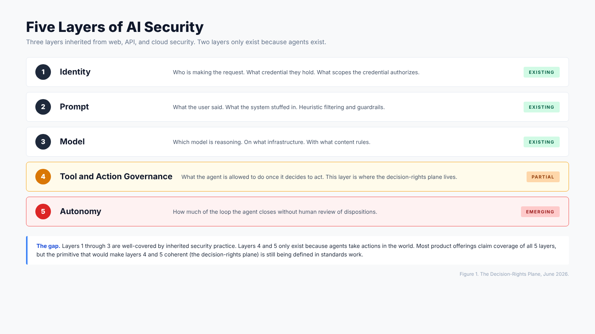
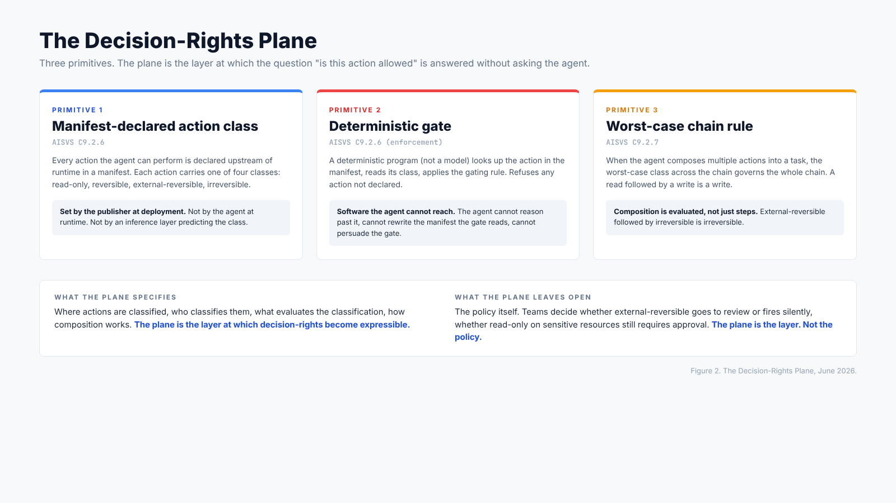
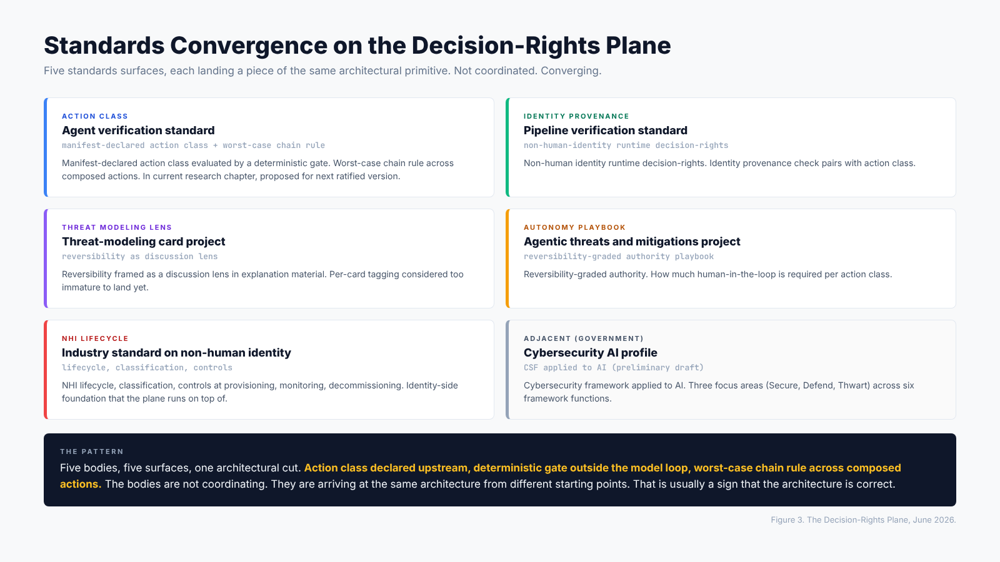

# The Decision-Rights Plane: An Architectural Gap in AI Security

**Date**: June 2, 2026
**Author**: Mayur Agnihotri
**Reading time**: ~10 minutes

## TL;DR

Most AI security work today addresses three of the five layers an agent runs through (identity, prompt, model). The two layers that only exist because agents exist (tool and action governance, autonomy governance) get bolted on to the existing stack without the right primitive underneath. That missing primitive is the decision-rights plane: manifest-declared action class evaluated by a deterministic gate, with worst-case action class governing across multi-step chains. This piece argues that the plane is not a vendor feature, it is a control-plane primitive, and offers a working method for how to see the gap, contribute to closing it across multiple standards surfaces, and ship reference implementations that make the spec real.

---

## The five layers, plain

If you stack what an agent has to pass through between a user instruction and an action that touches the world, five layers appear in order:

1. **Identity**. Who is making the request, what credential do they hold, what scopes does that credential authorize.
2. **Prompt**. What the user said, what the system has stuffed in, what the agent will read next.
3. **Model**. Which model is doing the reasoning, on what infrastructure, with what content rules baked in.
4. **Tool and action governance**. What the agent is allowed to do once it decides to act.
5. **Autonomy**. How much of the loop the agent is allowed to close without a human reviewing its dispositions.

The first three layers were inherited. Web, mobile, API, and cloud security have spent twenty years on identity. Prompt-side filtering and guardrails are an active research area but have direct ancestors in input validation. Model governance is being treated as an extension of software governance, with model cards, infrastructure isolation, and the usual perimeter controls.

The bottom two layers are new. They only exist because an agent is something that takes actions. A model that only returns text does not need a tool governance layer. A model that only summarizes a document does not need an autonomy boundary. The moment the agent calls a tool, those two layers light up. Today, most of the security work happening at those layers is happening without the primitive that would make the work coherent.

*Figure 1. The five layers an agent runs through. Layers 1 through 3 are inherited. Layers 4 and 5 only exist because agents take actions. The primitive that would make the bottom two layers coherent is the decision-rights plane.*

---

## What is missing at layers four and five

If you ask a typical product team how they govern tool and action use by an agent today, you get one of three answers.

The first answer is **a policy engine evaluating runtime requests**. An agent attempts an action, the policy engine looks up whether the calling identity is authorized, the request is allowed or denied. This is the same control that protects a microservice or a SaaS API. It is real, useful, and necessary, but it does not address the agent-specific failure mode. The credentials are correct. The identity is correct. The action is permitted. The question that this control does not answer is: should the agent be running this composite of actions in this order, with this much autonomy, toward this outcome.

The second answer is **a guardrail model checking the agent**. A separate language model inspects what the agent is about to do, refuses if the action looks unsafe. This pattern is now common. Recent research shows it can drive attack success rates significantly down. The remaining failure rate exists because the same kind of injection that fools the agent can fool the agent's checker. An LLM checking another LLM is not a trusted computing base. Trust does not compound when both checker and checked are derived from the same fallible reasoning. Some of this work also gets called "AI-firewall," with the same property.

The third answer is **human review after the fact**. The agent acts, the analyst reviews. This is the model that the most credible AI security operations deployments are using today, including the one published by the lab that makes the model. It works for reversible actions. It does not work for irreversible ones. Reading a log can be reviewed at leisure. Revoking a token cannot be reviewed after the token is gone.

What all three answers share is that they take the agent's runtime decision and try to put a control around it. They do not change the layer at which the decision-rights live. The decision is still inside the model. The control is still trying to catch the decision after the model has made it.

---

## The primitive that has not landed yet

The decision-rights plane is the layer at which the question "is this action allowed" gets answered without asking the agent. It has three components.

**Component 1: Manifest-declared action class.** Every action the agent can perform is declared upstream of runtime in a manifest. Each action carries a class. The class is one of read-only, reversible, external-reversible, or irreversible. The class is set by the publisher of the agent at deployment time, not by the agent at runtime, and not by an inference layer trying to predict the class. The class is data in a file, not text in a prompt.

**Component 2: Deterministic gate.** At action time, a deterministic program (not a language model) looks up the action in the manifest, reads its class, and applies the gating rule. The gate refuses any action not declared in the manifest. The gate is software the agent cannot reach. It does not ask the agent for its opinion. The agent cannot reason its way around the gate, cannot rewrite the manifest the gate reads, cannot persuade the gate. The gate exists outside the model's reasoning loop.

**Component 3: Worst-case chain rule.** When the agent composes multiple actions into a single task, the worst-case class across the chain governs the whole chain. A read followed by a write is a write. An external-reversible step followed by an irreversible step is irreversible. The gate evaluates the chain against its worst-case class, not against the average, not against the most recent step, not against the per-step classes considered in isolation.

These three together are the decision-rights plane. They specify where the action is classified, who classifies it, what evaluates the classification, and how composition works. They do not specify the policy itself. A team can decide that all external-reversible actions in their environment go to human review, or that they fire silently. A team can decide that read-only actions on certain resources still require approval. The plane is the layer at which these decisions are expressible, not the decisions themselves.

*Figure 2. The three primitives of the decision-rights plane. Manifest-declared action class, deterministic gate, worst-case chain rule. The plane is the layer at which decision-rights become expressible. It is not the policy itself.*

---

## Why the plane is not optional for the write side

The deepest reason for the plane is the asymmetry between investigation and actuation.

Investigation is reversible. Reading a log does not change the world. Drafting a hypothesis does not change the world. Querying a database does not change the world. An agent that explores freely and proposes a course of action can be reviewed before the action runs. The cost of giving the agent capability at investigation time is bounded.

Actuation is not reversible by default. Blocking a user, quarantining a host, revoking a token, pushing a patch, sending a notification, transferring funds, deleting a record. Once these fire, the agent cannot reason them back. The world is in a new state. Some of these can be undone with external coordination (the notification was sent, you can send a follow-up apology). Some cannot be undone at all (the token is gone, re-issuance is a new token, not a recovery).

For the write side, the gate has to be a gate, not a guardian. A guardian is something the agent can argue with. A gate is something the agent cannot reach. For irreversible actions, the requirement to consult the gate has to be declared in the manifest. The manifest is data. The agent cannot rewrite data it is not supposed to write.

This is also where the empirical defense of the plane gets strong. The published numbers from the most credible AI-driven security operations deployment show false positive rates dropping into single digits but never to zero, with a team of human analysts in the loop on top of the model. The architecture is investigation, not actuation. The model proposes. The human disposes. The remaining single-digit error rate is what the human is there for. This is not a failure of the model. This is the empirical floor for read-side autonomy at this generation of agents. The floor for the write side is different.

---

## What community standards work is doing

Once you accept that the decision-rights plane is the missing primitive, the standards-side activity in the last few months becomes legible as a convergence rather than a scatter. Multiple bodies are working on different parts of the same architecture.

One community-driven verification standard for AI security has merged a manifest-declared action class requirement and a worst-case chain rule into its current research chapter, proposed for the next ratified version. That is the layer-four primitive in spec form.

Another community pipeline verification standard has work in progress on non-human-identity runtime decision-rights. That covers the identity-side companion: the agent has an action class, but the identity invoking the action also has a permitted scope, and the gate has to check both. That work pairs cleanly with the action-class manifest.

Another project has explored a threat-modeling card extension for agentic AI, focused on whether the system being modeled has these primitives in place. The conclusion from that project's maintainers, after discussion, was that per-card action-class tagging is too immature to land in the official card set, but reversibility as a discussion lens belongs in the explanation material. That is a reasonable boundary. The cards work in the modeling step, the spec work in the implementation step.

Another standards initiative is producing a playbook for reversibility-graded authority in agentic AI threats and mitigations. That is closer to the autonomy layer: it asks how much of the loop an agent should close based on the class of action it is taking. That sits above the action class itself, because it answers the question "given that the action is classified, how much autonomy does the agent get."

Another industry standard published recently on non-human identity defines and classifies the identity side: what is an NHI, what are the lifecycle stages, what controls apply at provisioning, monitoring, decommissioning. That paper does not specify the action-class plane, but it builds the identity-side foundation that the plane runs on top of.

Across these five surfaces, the architecture that is converging is the same architecture. Action class declared in a manifest. Deterministic gate outside the model loop. Worst-case chain rule across composed actions. NHI runtime decision-rights checking identity provenance alongside action class. Reversibility-graded autonomy deciding how much human-in-the-loop is required for each action class.

That is what makes the convergence interesting. The bodies are not coordinating. They are arriving at the same architectural cut from different starting points. That is usually a sign that the architecture is correct.

*Figure 3. Five standards surfaces, each landing a piece of the same architectural primitive. The bodies are not coordinating. The convergence is the signal.*

---

## Where the gap still is

The standards-side work is in motion. The vendor stack is behind.

Most products in the AI security category today implement parts of the picture. Identity is well-covered. Prompt-side guardrails are common. Model-layer protections exist. Audit trails are widely available. Some products have policy engines that evaluate runtime requests, which corresponds to a partial implementation of layer four.

What is rare is the full primitive. The manifest-declared upstream classification, the deterministic gate that refuses anything not in the manifest, the worst-case chain rule across composed actions. Most product offerings either ask the model to self-classify (which the most rigorous current spec work specifically refuses), or use a separate model to check the agent (which is the LLM-checking-LLM issue), or apply policy rules that depend on the runtime context the agent is producing.

This is not a vendor failure. It is a sequencing failure. Standards work is just landing the primitive. The vendor stack will follow once the primitive exists in the standards. The pattern is consistent with how every prior security primitive has landed: spec first, reference implementations second, vendor adoption third, certification fourth, default expectation fifth. The decision-rights plane is currently between steps one and two for the most-active standards bodies.

The product market also has a marketing problem here. The honest framing is "we cover three layers, the other two are still being defined." Most product marketing has chosen instead to claim coverage of all five layers, with vague terminology around the bottom two. That makes it harder for buyers to ask whether the primitives are actually present. Some product categories have invented their own taxonomies that obscure the question. Some have folded "agent governance" into "AI firewall" or "AI SOC" categories where the underlying primitive does not have to be specified to make the category sale.

Anyone evaluating a product in the agentic-AI security category should ask three questions. Does the product require a manifest declaring each action's class, set at deployment by the publisher, and not derived from runtime model output? Does the gate that enforces the manifest run outside the model's reasoning loop, on code the model cannot reach? When the agent composes multiple actions, does the gate evaluate the chain against its worst-case class, not against per-step classes in isolation? Three yes answers means the product implements the plane. Three no answers means it does not. Mixed answers are common and acceptable, but worth understanding.

---

## How to contribute when you see a gap

This is the section that most readers actually want when they ask the question that titles this essay: "if you see a gap like this, what do you do." Five months of working across multiple standards surfaces produced a method that is worth sharing.

**Step 1: See the gap with precision.** A gap is not a missing feature in a product. A gap is a missing primitive in the control plane. The difference matters. If you frame a gap as "this product does not have action-class authority," vendors will add a feature called action-class authority. The feature will be a checkbox that does not change the architecture. If you frame a gap as "the primitive at this layer requires manifest-declared upstream classification evaluated by a deterministic gate outside the agent's reasoning loop," the conversation has to happen at the spec level before it can happen at the product level. See the gap as a primitive, name the primitive precisely, refuse to let the conversation drop to feature-level until the primitive is settled.

**Step 2: Find the surfaces where the primitive belongs.** Most non-trivial primitives are multi-surface. The action class is one surface. The identity provenance is another. The threat-modeling lens is a third. The autonomy playbook is a fourth. The lifecycle classification is a fifth. Each surface has a different maintainer community, a different review cadence, a different vocabulary. The work of contribution starts with identifying which surfaces touch the primitive, in what scope, with what existing vocabulary already in place. Read the existing spec work before proposing anything. Read it twice.

**Step 3: File an issue before a PR.** This is the rule that prevents most contributor pain. An issue is a question for the maintainer community. A PR is a proposed answer. If you open a PR without an issue, you are asking the community to evaluate your answer to a question they have not yet agreed is the right question. Always open the issue first. Let the maintainers respond. Let other contributors weigh in. If the discussion converges on a direction, then open the PR. If it converges on a different direction than you initially proposed, your PR will be better for it.

**Step 4: Restate, do not claim.** Most architectural primitives in security have prior art going back decades. Capability-based security goes back to the 1970s. Transactional database guarantees go back to the 1980s. Formal verification of safety-critical systems goes back to the same era. Physical-systems safety engineering, with envelope-based actuation limits, predates the entire field. The work of contribution is not to claim a primitive as new. The work is to lift the primitive into the modern vocabulary of agentic AI, with the right specs in the right places. Cite the prior art. Frame the contribution as restatement, not origination. This costs you nothing in credit and makes the contribution easier to land because the maintainers can see what you are building on.

**Step 5: Land it across multiple surfaces.** Single-spec coverage is fragile. A primitive that exists only in one spec is at the mercy of that spec's editorial cycle, its membership churn, its scope drift. A primitive that exists in three or four specs, expressed consistently, has resilience. Spending the same effort to land the same primitive in multiple surfaces, in language each surface can absorb, is the difference between a primitive that survives and a primitive that gets quietly removed in the next revision. This is patient work. It is also the work that actually changes the architectural floor.

**Step 6: Ship reference implementations.** A spec without code is aspirational. Code without a spec is parochial. The two together close the loop. For each spec contribution worth making, the contributor should also publish a minimal reference implementation that demonstrates compliance with the spec. The reference does not have to be production-grade. It has to be runnable, testable, and small enough to read in an afternoon. The vendor adoption that comes after the spec is dramatically easier when there is a reference to look at. The reference also surfaces ambiguities in the spec that the spec text alone would not catch.

**Step 7: Give buyers a way to ask.** Spec work and reference implementations help vendors. They do not directly help buyers. To close the loop, the contributor should also produce a small set of buyer-facing evaluation questions, expressed in language a procurement team can use without needing the spec text. The three-question evaluation in the previous section is an example: declare the manifest, gate outside the loop, worst-case chain rule. Buyers can ask those questions even if they do not know what spec they correspond to. That is the form the primitive takes when it reaches the market.

These seven steps are not original to me. They are the working method of how community standards have always moved. The only reason to write them down here is that the agentic AI space is currently full of contributors who skip steps three through seven, and the result is feature-level confusion in the vendor market. If more contributors used the full method, the decision-rights plane would land faster.

---

## Conclusion

The decision-rights plane is the layer at which the question "what is this agent allowed to do" is answerable without asking the agent. The model is the worker. The deterministic gate plus the named human is the architecture.

The standards-side work to land the plane is happening now, across multiple surfaces, with convergence on the same architectural cut. The vendor-side work will follow once the spec coverage is consistent. The buyer-side work is to ask whether the products being evaluated implement the primitive, and to read the answer charitably when it is "partial" and skeptically when it is "yes, all layers covered."

For anyone working in agent security right now, this is what I would suggest is worth the next few months of attention: get clear on whether the work in front of you is about layer four (tool and action governance) or layer five (autonomy), be precise about whether the primitive at that layer is present, and contribute back to the standards surfaces that are doing the spec work. The architectural floor matters before the implementation choices.

If you see a gap, name it as a primitive, find the surfaces where it belongs, file the issue before the PR, restate rather than claim, land it across multiple surfaces, ship a reference implementation, and give buyers a way to ask. That is the working method.

---

## License

This piece is licensed CC-BY-4.0. Quote, translate, and redistribute with attribution.

## Citation

Agnihotri, Mayur. "The Decision-Rights Plane: An Architectural Gap in AI Security." Personal essay. June 2, 2026. https://github.com/Mayur021/writings/blob/main/2026-06-02-decision-rights-plane/README.md

## Related work

- Capability-based security (Dennis & Van Horn, 1966; Levy, 1984) and the lineage of object-capability systems.
- Transactional database theory and the ACID guarantees, particularly atomicity and durability as architectural primitives that constrain reversibility.
- Formal verification of safety-critical systems and the use of envelope-based actuation limits in aerospace and industrial control.
- Recent academic work on agent security as a systems problem (2026), including the principle that an LLM checking another LLM is not a trusted computing base.
- Empirical results on LLM-based skill-injection defenses and their residual attack success rates.
- Industry deployment data from the most credible AI-driven security operations deployment, including published false-positive rates with humans in the loop.
