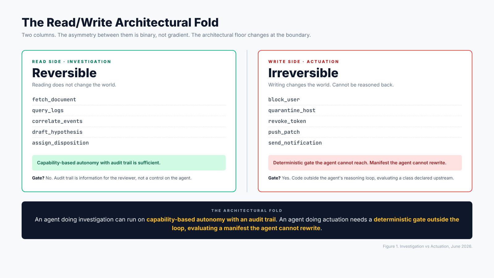
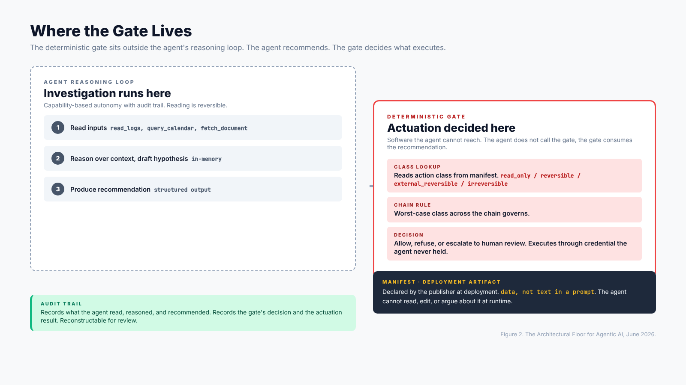

# Investigation Is Reversible. Actuation Is Not. The Architectural Floor for Agentic AI.

  *Investigation is reversible. Actuation is not. The read/write architectural fold as design primitive for agentic AI security. Where the gate lives.*

**Date**: May 30, 2026
**Author**: Mayur Agnihotri
**Reading time**: ~8 minutes

## TL;DR

The simplest architectural distinction in AI agent security is invisible to most product marketing. Investigation, the read side of agent work, is reversible by definition. Actuation, the write side, is not. The architectural floor changes at that boundary. An agent doing investigation can run on capability-based autonomy with an audit trail. An agent doing actuation needs a deterministic gate the agent cannot reach, evaluating a manifest the agent cannot rewrite. Most products today fail to distinguish between the two and end up either too cautious for investigation or too permissive for actuation. This piece argues that the read/write distinction is a design primitive, shows where the gate has to live, and walks through what happens when you redesign an agent around the distinction.

---

## The asymmetry

If you list the actions an agent can perform, two columns sort themselves out almost immediately.

The first column is **read**. The agent fetches a document. Pulls a log. Queries a database. Correlates events. Drafts a hypothesis as text in a buffer. Computes a suggested action and stores it as a recommendation. None of these change the world. The agent's effect on the system is bounded to the inputs the agent saw and the outputs the agent produced. Anyone who reviews the work can reconstruct what happened. If the agent did the wrong thing, the wrong thing was a thought, not a deed.

The second column is **write**. The agent blocks a user. Quarantines a host. Revokes a token. Pushes a patch. Sends a notification. Transfers funds. Deletes a record. Creates a calendar invite. Each of these changes the world in a way that persists after the agent stops thinking. The world is in a new state.

The asymmetry between the two columns is not gradient. It is binary. Investigation does not become actuation by becoming high-stakes investigation. Actuation does not become investigation by being small actuation. The distinction is whether the agent's action persists outside the agent's process after the agent has finished reasoning.

This distinction is architectural, not policy. A policy choice would be "do not let the agent send invites without approval." An architectural choice is "design the agent so the send-invite path cannot be exercised by the agent's reasoning loop alone, regardless of policy." The architectural choice is upstream of the policy choice.

*Figure 1. The simplest architectural fold in agent design. Investigation lives on the read side and can be reviewed after the fact. Actuation lives on the write side and cannot be undone by review alone.*

---

## Why investigation can run with capability-based autonomy

Investigation tolerates exploration. An agent that has read access to logs and is given a goal can take many investigation paths to reach an answer. Some paths will be more thorough than others. Some will find anomalies the agent was not asked about. Some will dead-end and require restarting. The cost of giving the agent freedom on the read side is bounded by how much compute the agent burns and how cluttered the audit trail gets.

This is why the most credible published deployments of AI in security operations let the model investigate freely. The model reads logs, runs queries, correlates findings across systems, drafts hypotheses, and assigns dispositions. A human analyst reviews the dispositions afterwards. The model's investigation traces are auditable. The model's reasoning is reconstructable. The cost of a bad investigation is bounded.

What this means in practice is that the gate for the read side does not have to be a gate. It can be an audit trail. The agent runs. The work is recorded. The reviewer sees what happened and adjusts. The cycle improves over time as the team understands how the model investigates.

A subtle point that often gets lost: the audit trail is not a control on the agent. The audit trail is information for the reviewer. The agent still ran. The model still saw the inputs. The actions still happened on the read side. None of that is undone by the audit trail. What the audit trail provides is the reviewer's ability to evaluate the work after the fact and adjust the next cycle. For investigation, that is sufficient.

This is also why investigation tolerates non-determinism. An agent that investigates differently on different days, sometimes finding something the same agent missed on a previous day, is not a failure of investigation. It is a feature. The audit trail captures both runs. The reviewer can compare. The investigation is improved by the comparison. Two slightly different investigation paths starting from the same alert can both be correct and both add information.

---

## Why actuation cannot run with capability-based autonomy

Actuation does not tolerate exploration. The first time the agent sends the invite, the invite is sent. The first time the agent revokes the token, the token is gone. The first time the agent quarantines the host, the network is in a new state. There is no second attempt at the same action that does not have to deal with the consequences of the first attempt.

This is why the write side cannot run on the same architecture as the read side. The audit trail captures what happened, but the audit trail does not put the token back. The audit trail tells the reviewer the agent blocked a user, but the audit trail does not unblock the user. The action's effect is in the world. The audit trail is a memory of the effect.

For actuation, the gate has to be a gate. It has to refuse actions the agent should not take, before they happen. It has to evaluate the proposed action against a rule the agent did not write. It has to be code outside the agent's reasoning loop, code the agent cannot reach.

There is a subtle but important point about what the gate should not be. The gate should not be another language model checking the agent. The gate should not be a guardian model with discretion. The gate should not be something the agent can argue with by phrasing the request differently. The gate has to be deterministic in the literal sense: the same input produces the same output every time, and the input is data the agent did not produce.

The reason for the determinism requirement is that an agent that can argue its way past the gate has effectively no gate. The agent generated the inputs. The model that checks the inputs is reasoning over the inputs the agent generated. Whatever weakness the first model has is inherited by the second model. The two together do not form a trusted computing base. Trust does not compound when both layers are derived from the same kind of fallible reasoning.

The way to get a gate is to keep the inputs to the gate out of the agent's reach. The action class for the action lives in a manifest declared at deployment by the publisher. The gate reads the manifest. The agent cannot read the manifest at runtime in any way that lets the agent change the manifest. The agent cannot send a request to the gate that includes "the class for this action is now read-only." The action has its class in the manifest, and the gate reads it from there, and that is what governs.

*Figure 2. The deterministic gate sits outside the agent's reasoning loop, reading a manifest the agent cannot rewrite. The audit trail records what happened. The gate decides what was allowed to happen.*

---

## What this means for product architecture

If you accept the read/write architectural fold, several product design decisions become forced moves rather than open questions.

**Decision 1: The agent's permission scope at runtime is the read side only.** The credentials the agent uses to investigate should be read-only credentials. The roles the agent assumes should not have write permission to systems the agent investigates. This sounds obvious but is consistently violated in practice because teams provision the agent for the most ambitious version of its job (read and act) instead of provisioning the agent for the actual investigation it does and routing the write actions through a different, gated path.

**Decision 2: The write path is a separate flow that the agent can request but not execute.** The agent that finishes an investigation produces a recommendation. The recommendation is structured data describing what action is recommended, against what target, with what justification from the investigation. The recommendation flows to a separate component, the deterministic gate, which evaluates it against the manifest and against the policy. If approved, the action executes through a service account or credential the agent never holds. If denied, the recommendation is rejected with a recorded reason.

**Decision 3: The manifest of allowable actions is declared upstream of the agent.** The manifest is a deployment artifact, not a runtime artifact. The agent does not know what is in the manifest beyond what the gate's interface exposes. The agent cannot enumerate the manifest. The agent cannot edit the manifest. The team that deploys the agent edits the manifest deliberately, with the same kind of change-management practice they would apply to any other authorization rule.

**Decision 4: The chain of actions an agent composes is evaluated against the worst-case class across the chain.** If an investigation produces a recommendation for a single irreversible action, the chain's worst-case class is irreversible. If an investigation produces a recommendation for three read actions and one external-reversible action, the chain's worst-case class is external-reversible. The chain inherits the worst case from any of its members. The gate evaluates the chain at the chain level, not at the per-step level.

**Decision 5: The audit trail records both sides.** The audit trail captures the investigation (what the agent read, what it computed, what hypothesis it formed, what disposition it assigned). The audit trail also captures the actuation (what action was requested, what the gate decided, who or what executed the action, what the result was). The two audit trails are linked by the recommendation. This makes reconstruction possible after the fact.

---

## A worked example: the calendar agent

Imagine an agent whose job is to help a user schedule meetings. The naive design is: give the agent read access to the calendar and write access to send invites. The agent looks at the calendar, picks a good time, sends the invite.

This design conflates read and write. The agent that picks the time and sends the invite is doing both investigation and actuation in a single loop. If the agent picks the wrong time, the invite has already gone out. If the agent picks an external recipient inappropriately, the email has already been sent. The cost of error is realized before any review can happen.

A redesign that respects the fold looks like this. The agent reads the calendar. The agent computes a recommendation: "send an invite for Tuesday 3pm, recipients X, Y, Z, with title T, with description D." The recommendation flows to the gate. The gate checks the manifest. The send-invite action is classified external-reversible because it reaches outside the system to external recipients. The manifest declares that external-reversible actions require human-in-the-loop approval. The user sees the recommendation and either approves or modifies it. If approved, the invite goes out through a service account that the agent never possessed credentials for. If modified, the modified version goes out. If denied, the recommendation is recorded as denied.

The agent did not become less useful. The agent still produced the recommendation, found the right time, drafted the description. What changed is the actuation step is now gated. The user reviews each external-recipient invite before it goes out. For a delete-event action, the class is irreversible (because once an event is deleted, the audit trail cannot recreate the event in the same state with the same participants). Irreversible actions require explicit re-confirmation in the manifest.

The agent in this redesign runs with capability-based autonomy on the read side and a deterministic gate on the write side. The asymmetry between the two columns is honored architecturally.

---

## A worked example: the incident response agent

Imagine an agent whose job is to investigate security alerts and recommend response. The naive design is: give the agent read access to logs and SIEM, and write access to block users, quarantine hosts, and revoke tokens, so the agent can both investigate and respond.

This design fails for the same reason. The investigation and the actuation are in the same loop. The agent that decides "this alert is a true positive, block the user" sends the block request directly. If the agent is wrong, the user is already blocked, and the team is in a recovery posture rather than a prevention posture.

A redesign that respects the fold splits the agent. The agent reads SIEM logs, correlates events, drafts a hypothesis, assigns a disposition. If the disposition is "needs response," the agent produces a structured recommendation: "block user U, justification J, evidence E." The recommendation flows to the gate. The gate checks the manifest. The block-user action is classified irreversible (because unblocking is a separate action with its own audit trail, not a recovery of a previous state). The manifest requires explicit human approval for irreversible actions. A named human reviews the recommendation. If approved, the block is executed through a credential the agent never held. If denied, the recommendation is rejected.

This is the same agent doing the same work, but the agent's authority stops at recommendation. The actuation is gated. The team operating the agent can run many cycles of investigation, build up a knowledge base of what kinds of alerts produce true positives, tune the agent's investigation, all without the agent ever taking an irreversible action without a human in the loop.

---

## What changes when you adopt the primitive

The first thing that changes is the conversation with vendors. Most product offerings claim to govern AI agents end-to-end. When you ask whether the gate is code the agent cannot reach, whether the action class is declared upstream by the publisher, whether the chain rule applies, you get answers that fall into three buckets. Some products have all three. Some have one or two. Many have none of the three but claim coverage of the use case anyway. The fold gives you three concrete questions to ask, and the answers clarify which products are actually doing the work.

The second thing that changes is the design conversation inside your own team. Teams that adopt the fold spend less time arguing about whether a given action is high-risk and more time arguing about whether the action is read or write. The argument about classification becomes shorter because the manifest forces an explicit declaration. The argument about authority becomes shorter because the chain rule forces the worst-case class to govern.

The third thing that changes is the failure mode of the agent. Before the fold, the agent that misclassifies an action can take an irreversible action in error. After the fold, the agent that misclassifies an action gets refused at the gate. The error is moved upstream to deployment time, where the manifest can be reviewed at leisure, instead of left to runtime, where the misclassification produces an unrecoverable consequence.

---

## Common misconceptions

**"The chain rule slows things down."** No. The chain rule fires only when the agent composes multiple actions. A single read action does not invoke the chain rule. The chain rule is the rule for composed actions, and composition is a feature, not a default. Single-action agents are unaffected.

**"The gate is overkill for low-risk actions."** No. The gate is sized to the action class. For read-only actions the gate is a no-op. For reversible actions the gate is a policy lookup. For external-reversible the gate is an approval workflow. For irreversible the gate is a mandatory human review. The gate adapts to the action class declared in the manifest. It does not impose human-in-the-loop everywhere.

**"The manifest is too much overhead."** Compared to what. Compared to running an agent without a manifest, yes, the manifest adds work. Compared to running an agent that takes an irreversible action in error and then having to recover, no, the manifest is dramatically less work. The manifest is the artifact that pays for itself in the first prevented error.

**"This is just role-based access control with extra steps."** No. RBAC governs who can call an API. The action class governs whether a particular call by an authorized identity should be executed at all, given the action's reversibility and the chain it sits in. These are orthogonal. An RBAC system can be in place and the agent can still take an irreversible action that nobody intended to authorize for this chain. The manifest catches that case.

---

## Conclusion

The read/write architectural fold is the simplest design primitive in agent security and the most frequently missed.

For investigation, the agent runs with capability-based autonomy and an audit trail. The agent can explore freely. The cost of error is bounded by the reviewer's ability to evaluate the work after the fact.

For actuation, the agent does not act. The agent recommends. The deterministic gate, reading a manifest the agent cannot rewrite, decides whether the recommended action executes. The chain of actions is evaluated against the worst-case class across the chain.

If you are designing an agent, start with the fold. Walk through the actions the agent will take. Put each one on the read or write side. For the write side, design the gate before you design the agent. The gate is not a feature you add later. The gate is the boundary the agent is built around.

The architecture is investigation, not actuation. The model is the worker. The named human and the deterministic gate are the architecture.

---

## License

This piece is licensed CC-BY-4.0. Quote, translate, and redistribute with attribution.

## Citation

Agnihotri, Mayur. "Investigation Is Reversible. Actuation Is Not. The Architectural Floor for Agentic AI." Personal essay. June 2, 2026. https://github.com/Mayur021/writings/blob/main/2026-06-02-investigation-vs-actuation/README.md

## Related work

- [The Decision-Rights Plane: An Architectural Gap in AI Security](../2026-06-02-decision-rights-plane/) (companion piece in this collection).
- Capability-based security and the lineage of object-capability systems.
- Transactional database theory and the ACID guarantees.
- Recent academic work on agent security as a systems problem, including the trusted-computing-base argument.
- Empirical results on LLM-based skill-injection defenses and their residual attack success rates.
- Reference implementations: [aisvs-action-class-reference](https://github.com/Mayur021/aisvs-action-class-reference) and [nhi-runtime-decision-rights](https://github.com/Mayur021/nhi-runtime-decision-rights).
