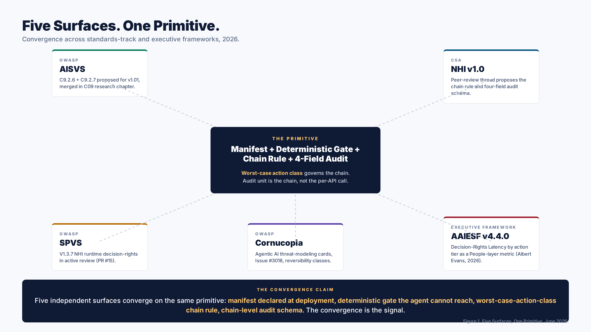
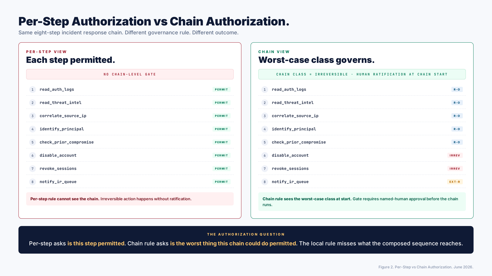

# Per-Step Authorization Is Not Chain Authorization. The Worst-Case Action Class Primitive.

*The architectural primitive five independent standards surfaces and executive frameworks are converging on, and why the audit schema is inseparable from the authorization rule.*

**Date**: June 3, 2026
**Author**: Mayur Agnihotri
**Reading time**: ~12 minutes

## TL;DR

A composed multi-step agent action is not the sum of its per-step authorizations. The chain reaches an irreversible outcome by walking a sequence of individually-permitted steps. Per-step least privilege does not catch this. The architectural primitive that does is simple: the chain's worst-case action class governs the chain, not the average. The gate evaluates against a manifest declared at deployment, not against runtime claims the agent produces. The audit unit is the chain, not the per-API call. This piece walks through why the primitive is load-bearing, where it is showing up across five independent surfaces in the standards-track and executive-framework literature, and why the audit schema is not separable from the authorization rule.

---

## The gap per-step authorization leaves

If an agent is allowed to read calendar entries, draft text, and send invites, every individual capability is small. The first two are read-side and reversible. The third is external-reversible, which most policies treat as low-risk because the action can be retracted by a follow-up message. Per-step authorization sees three permitted actions in sequence and grants the agent every step.

What per-step authorization does not see is the chain.

The chain is what reaches the irreversible outcome. The agent reads the calendar, identifies the executive's confidential schedule, drafts an invitation that exposes the meeting topic, and sends the invitation to an external recipient. Every step is permitted. The composed result is a confidentiality breach the per-step rule did not anticipate.

This is the gap. It is structural, not a policy oversight. Per-step authorization is a local rule. The chain is a global property. You cannot derive the chain's worst-case class from the per-step decisions because the per-step decisions are evaluated independently of the chain they sit in.

The standards-track work and the executive-framework work that take this gap seriously have all converged on a similar primitive. The chain's worst-case action class is the governance rule. The gate that enforces it sits outside the agent's reasoning loop. The manifest the gate reads is declared at deployment, not at runtime. The audit unit is the chain, not the call.

---

## The primitive in three parts

The primitive is three claims tied together.

**Claim 1: The action class is declared in a manifest at deployment.** Each callable action the agent can invoke has a class declared by the publisher when the agent is deployed. Read-only is one class. Reversible is another. Externally-reversible is a third. Irreversible is the fourth. The classes are declarative metadata about the action, not about the request. The class belongs to the action. It does not change based on what the agent says about the action at runtime.

**Claim 2: A deterministic gate evaluates against the manifest.** The gate is code outside the agent's reasoning loop. The gate cannot be argued with. The gate cannot be persuaded by a differently-phrased request. The gate reads the manifest and produces a decision deterministically: the same inputs always produce the same output, and the inputs are not generated by the agent. The gate is not another language model. It is not a guardian with discretion. It is a deterministic function over the manifest and the request.

**Claim 3: The chain's worst-case class governs the chain.** When the agent composes multiple actions in sequence, the chain inherits the worst-case class from any of its members. If the chain contains three reads and one irreversible write, the chain's class is irreversible. The gate evaluates the chain at chain start, not per-step. The authorization question shifts from "is this step permitted" to "is the worst thing this chain could do permitted."

The three claims tie together because they are not independently sufficient. Without the manifest, the gate has nothing to evaluate against. Without the gate, the manifest is documentation that does not enforce. Without the chain rule, the manifest and gate evaluate per-step, and the per-step gap remains.

The architectural primitive is the three claims as a single rule.

---

## The audit-trail twin

The thread in the CSA Non-Human Identity peer review during early June 2026 surfaced the audit-trail half of the primitive. The authorization rule says the chain's worst-case class governs. The audit-trail rule says the chain's composed-step record is the audit unit.

Per-API-call logging tells you what fired. It does not tell you whether the chain that fired it was within scope. Even with perfect per-step logging, the audit cannot retrospectively reconstruct the authorization question. The reviewer asks "was this chain permitted given its worst-case class," and the per-API-call log answers "this step was a permitted API call." The two questions are different. The per-step log answers the wrong one.

For the audit to reconstruct the authorization question retrospectively, the audit record needs four fields:

1. **Chain identifier** linking the composed steps as a single unit.
2. **Declared worst-case action class** at chain start, recorded before the chain executes.
3. **Gate decision and justification**, including the rule the gate applied and any approval evidence.
4. **Per-step API record** capturing what fired, with what arguments, against which resource.

Without (1) and (2), the audit cannot reconstruct the authorization question. The per-API-call records exist but do not compose. The reviewer sees a sequence of permitted calls and cannot determine whether the sequence as a whole was within scope.

This makes the audit-trail design downstream of the chain-rule design. If you adopt the chain rule but keep per-API-call logging, you have an enforcement layer the audit cannot evaluate retrospectively. If you adopt the audit schema but not the chain rule, the audit records exist but no rule was applied at runtime to drive a chain-level decision. The two have to ship together.

---

## The five surfaces

This primitive is appearing in independent standards-track and executive-framework work. The convergence is itself a signal. Five surfaces, four organizations, framing the same architectural floor.

**OWASP AISVS, C9 research chapter, requirements proposed for v1.01.** C9.2.6 specifies that the gate evaluation runs against the manifest, not against agent-produced runtime claims. C9.2.7 specifies that the chain's worst-case action class governs the chain. These two together are the verification-side specification of the manifest-and-gate primitive.

**OWASP SPVS, V1.3.7, in active review.** This requirement places the NHI runtime decision-rights specification inside the Software Production Verification Standard for pipeline-side non-human identities. PR #15 is open against the SPVS repository. The pipeline-side decision-rights work is the standards-track placement of the runtime gate at the build and deployment surface.

**OWASP Cornucopia, Agentic AI cards, Issue #3018.** The agentic-AI threat-modeling cards reference reversibility class as the categorization axis. The cards categorize action classes as read-only, reversible, externally-reversible, and irreversible. The Cornucopia framing is the threat-modeling-side surface of the same primitive.

**CSA Non-Human Identity v1.0 peer review.** The peer-review thread during early June 2026 connected the per-step gap explicitly to the OWASP Top 10 for Agentic Applications MCP prompt-injection scenario, then proposed the chain-level worst-case-action-class rule with the four-field audit schema attached. The CSA work is the NHI-runtime-side surface.

**Agentic AI Enterprise Strategy Framework v4.4.0 by Albert Evans.** This framework treats Decision-Rights Latency by action tier as a People-layer metric, references Doshi et al. 2026 verifiably-safe-tool-use as a Section 8A foundation, and frames the shift from probabilistic safeguards to deterministic controls at the tool boundary as a load-bearing claim. The framework's Section 10 worked example on agentic SOC triage enumerates what triage must never automate: endpoint isolation, privileged session revocation, secret rotation, business-critical blocking. This is the read/write architectural fold by enumeration, in an executive framework.

Five surfaces. Verification standard (AISVS). Production-verification standard (SPVS). Threat-modeling deck (Cornucopia). NHI runtime specification (CSA). Executive operating model (AAIESF). All five point at the same architectural primitive: manifest plus deterministic gate plus chain rule plus chain-level audit.

The convergence is not coordination. The five surfaces have different authors, different review processes, different anchors. They converge because the primitive is load-bearing under independent analysis.

*Figure 1. Five independent standards-track and executive-framework surfaces converging on the same architectural primitive. The convergence is the signal.*

---

## A worked example: the multi-step incident response chain

The agent is investigating an alert. The alert is a credential-stuffing attempt against an internal application. The agent has read access to authentication logs, threat intelligence feeds, and the directory service. The agent has write capability to disable user accounts and to revoke active sessions. The agent is asked to investigate and respond.

The naive design grants per-step authorization to each capability. Reading logs is permitted. Reading threat intel is permitted. Disabling a user is permitted (the agent has the role). Revoking a session is permitted.

The chain the agent composes looks like this:

1. Read authentication logs (read-only).
2. Read threat intel (read-only).
3. Correlate the source IP with the targeted account (read-only).
4. Identify the account holder as a senior executive (read-only).
5. Determine the credential-stuffing has succeeded on three prior occasions per the logs (read-only).
6. Disable the account to prevent further compromise (irreversible).
7. Revoke active sessions (irreversible).
8. Notify the incident response queue (external-reversible).

Per-step authorization passes each step. The chain is composed of one irreversible action (disable account), one further irreversible action (revoke sessions), and one external-reversible action (notify queue).

Under the chain rule, the chain's worst-case class is irreversible. The gate evaluates the chain at chain start. The chain's declaration is "this chain proposes to investigate the credential-stuffing alert and may take irreversible action on the senior executive's account based on the investigation." The gate's evaluation is not "is each step permitted" but "is this chain permitted to take an irreversible action on this principal given this chain's class declaration."

Two things change. First, the chain pauses at chain start for human ratification of the worst-case class. The investigation proceeds. The actuation steps wait. If a named human approves the irreversible class for this chain against this principal, the chain proceeds. If not, the chain stops, the investigation results are retained, and the recommendation is queued for review.

Second, the audit record for this chain has the four fields. Chain identifier ties the seven log records, the directory-service read, the correlation step, the disable-account API call, the session-revoke API call, and the notification call into one chain. The declared worst-case class (irreversible) is recorded at chain start before the chain executes. The gate decision (approved by named human, evidence reference) is recorded at the chain-start gate. The per-step API record is recorded for each step.

A reviewer two months later asks "was the disable-account decision on June 3 within scope." The per-step log says "this step was a permitted API call." The chain-level audit record says "the chain was declared irreversible at start, was approved by the named human on the evidence presented, and proceeded to the irreversible steps with that approval as authority." The reviewer can reconstruct the authorization question because the audit captures the chain-level decision, not just the per-step API call.

Per-step authorization gives the first answer. Chain rule plus chain-level audit gives the second answer. The second is the one the reviewer needs.

*Figure 2. The same eight-step chain under two governance rules. Per-step authorization permits every step locally; the chain reaches an irreversible outcome without ratification. Chain authorization declares the worst-case class at chain start and gates the chain before it runs.*

---

## The MCP prompt-injection case the primitive catches

The OWASP Top 10 for Agentic Applications released in December 2025 includes an MCP prompt-injection scenario. An agent reads a document. The document contains a prompt injection. The injection instructs the agent to invoke a tool sequence that reaches an irreversible action. Per-step, every tool call is permitted (the agent has the capability). The chain reaches an irreversible outcome.

The primitive catches this because the chain rule is upstream of the agent's runtime reasoning. The chain's worst-case class is declared by the manifest, not by the agent. The injection cannot change the manifest. The injection can convince the agent to attempt the chain, but the chain's class is irreversible (by manifest), and the gate at chain start requires the chain's class authority. The gate's authority is not derived from the document the agent read. The chain stops at the gate.

This is the practical impact of the architectural separation. The agent's reasoning is allowed to be persuadable. The manifest is not. The gate's decision rule is anchored on the manifest, not on the reasoning. The injection cannot reach the gate because the input to the gate is not produced by the agent.

A defense built on per-step authorization cannot make this guarantee. The injection can compose a sequence of per-step-permitted calls. Each call passes per-step. The chain reaches the irreversible outcome. The defense was at the wrong level.

This is also why the primitive does not depend on detecting the injection. Detection is hard. The chain rule does not require detection. The chain rule produces the same enforcement decision whether the agent's reasoning was prompted by a legitimate analyst or by an adversarial document. The agent attempts the chain. The gate evaluates the chain against the manifest. The chain either passes or stops. Detection is downstream; the chain rule is upstream.

---

## Why the gate cannot be another language model

The gate has to be deterministic. The same input produces the same output, and the input is data the agent did not produce. The reason is that an agent that can argue its way past the gate has effectively no gate.

A language-model-based gate inherits the persuadability of language models. If the agent's reasoning can be persuaded by a clever request, a second language model checking the agent can be persuaded by the same kind of request. The two together do not compose into a trusted computing base. Trust does not multiply when both layers are derived from the same kind of fallible reasoning.

The published work on this point is Christodorescu's argument that a language model checking another language model does not form a trusted computing base. The argument is structural, not empirical. Even if the gate model is more capable, more aligned, or trained differently, the gate model is reasoning over the same kind of input the agent produced. Whatever weakness the first model has is inherited by the second.

The way to get a gate is to keep the gate's input out of the agent's reach. The action class for the action lives in the manifest, declared at deployment by the publisher. The gate reads the manifest. The agent cannot read the manifest at runtime in any way that lets the agent change the manifest. The agent cannot send a request to the gate that includes "the class for this action is now read-only." The action has its class in the manifest, the gate reads the manifest, the manifest is the rule.

This is also why the empirical result on language-model-as-defense is sobering. The published study on skill-injection-by-LLM-guardian achieves an 81.4 percent attack success rate at baseline and a 18.6 percent residual attack success rate after the language-model guardian is in place. The residual is not zero. The residual is approximately one in five attacks succeeding. For an irreversible action, one in five is not a workable rate.

Determinism is not a stylistic preference. It is the floor below which the architectural primitive does not hold. A gate that can be argued with is not a gate.

---

## What the convergence implies for product architecture

Five surfaces pointing at the same primitive changes the product-architecture conversation in a specific way.

The buyer can now ask three questions and get separated answers across the vendor landscape.

**Question 1: Where is the action class declared?** A vendor whose answer is "in the agent's runtime configuration" is not declaring at deployment. A vendor whose answer is "in a manifest reviewed by the publisher and signed at deployment" is. The two architectures are different. The first does not survive prompt injection. The second can.

**Question 2: Is the gate deterministic, or does it use a language model?** A vendor whose gate is a language model has inherited persuadability. A vendor whose gate is a deterministic function over the manifest does not. The architectures look similar on a marketing slide. They are different on the failure mode that matters.

**Question 3: Is the audit unit the chain or the API call?** A vendor whose audit is per-API-call cannot retrospectively answer the chain-level authorization question. A vendor whose audit records chain identifier, declared worst-case class, gate decision, and per-step records can. The first audit cannot pass an incident postmortem that depends on chain-level scope. The second can.

Three questions. They sort the vendor landscape into ones that have architected for the primitive and ones that have not. The convergence across five standards-track and executive-framework surfaces gives the buyer the standing to ask them.

The convergence also implies something about the standards-track work itself. The primitive is not the proprietary contribution of any one vendor or any one author. It is the architectural floor that independent analyses converge on under the constraint of "what would actually hold up against composed agent action." The standards work catalogs and refines the primitive. The vendors implement it. The buyers verify it.

---

## A second worked example: the NHI substrate layer

The NHI runtime is not the only NHI layer the primitive applies to. The pipeline signs the artifact path. The substrate the artifact runs on has its own identity surface. The firmware the substrate runs on has its own identity surface below that. The standards-track work has been concentrated on pipeline NHI to date. Substrate and firmware NHIs have a verification gap.

Consider a hardware security module that holds production secrets. The substrate NHI is the attested firmware plus measured boot plus signed runtime configuration that together claim "this is the production HSM with these properties." The runtime gate that decides whether the agent can request a key from this HSM is not the gate that decides whether the agent can invoke a key-issuance API. It is the gate that decides whether the substrate the request is going to is the one declared by the manifest.

The architectural primitive transfers cleanly. The substrate's attested identity is declared in the manifest at deployment. The deterministic gate evaluates the attestation chain against the manifest. The chain's worst-case class governs across composed multi-host operations. The audit unit is the substrate-side chain, with chain identifier, declared worst-case class, gate decision, and per-attestation record.

The same applies to the firmware layer below substrate. The trust anchor is declared by the manufacturer. The firmware cannot rewrite the trust anchor. The gate that evaluates firmware attestations sits outside the firmware scope. The chain rule applies to multi-component firmware chains.

The primitive that the pipeline NHI standards work has been refining is not pipeline-specific. It is the architectural primitive that applies across all three NHI layers. The proposed OWASP SPVS V1.3.7 NHI runtime decision-rights work places it at the pipeline layer. The same primitive, with substrate-specific declaration mechanisms (attested firmware, measured boot) and firmware-specific declaration mechanisms (manufacturer trust anchors), extends to the layers below.

This is the practical implication of treating the primitive as architectural rather than as a feature of one layer. The primitive is portable. The declaration mechanism varies by layer. The gate and chain rule are the same.

---

## What changes inside an organization that adopts the primitive

Three things change.

The first is what the security team asks vendors. The three questions above replace the previous conversation about end-to-end agent governance. The conversation becomes sharper because the questions are not about feature coverage but about architectural placement.

The second is what the security team's own systems look like. The audit pipeline expands to capture the four-field chain record. The runtime layer in front of agents grows a manifest review step. The deployment pipeline grows a manifest signing step. The change is concentrated in three places rather than diffused everywhere.

The third is what the security team's incident postmortems look like. The postmortem now has a chain-level authorization question to answer, and the audit can answer it. The previous postmortem, which asked "did this agent take an action it should not have taken" and tried to answer it from per-API-call logs, becomes the postmortem that asks "was the chain that produced this outcome within scope" and answers it from the chain record. The postmortem becomes more productive because the question is sharper.

The primitive is not a feature retrofit. It is the architectural floor the rest of the agent security stack rests on. Adopting it changes the floor. The rest of the stack adapts.

---

## Conclusion

Five independent standards-track and executive-framework surfaces have converged on a single architectural primitive: manifest-declared action class, deterministic gate the agent cannot reach, chain's worst-case class governs the chain, chain-level audit with four-field record. The convergence is the signal.

Per-step authorization is not chain authorization. The chain is what reaches the irreversible outcome. The chain rule is what catches the gap. The audit schema is inseparable from the rule because per-API-call logging cannot retrospectively answer the chain-level question.

The primitive is portable. Pipeline NHI is where the standards-track work has concentrated. Substrate NHI and firmware NHI have the same primitive with different declaration mechanisms. The executive-framework work treats Decision-Rights Latency by action tier as a measured property of the People layer. The verification-standard work specifies what the gate evaluates against. The threat-modeling work catalogs the reversibility classes. The NHI runtime work specifies the chain rule and the audit schema together.

If you are designing an agent system, the primitive is the foundation. If you are buying an agent product, the three questions sort the landscape. If you are contributing to the standards-track work, the primitive is where the contributions are converging. The architectural floor is shared.

The work continues, both in standards and in deployment. The convergence so far is reason to expect the primitive to be the floor that holds.

---

## License

This piece is licensed CC-BY-4.0. Quote, translate, and redistribute with attribution.

## Citation

Agnihotri, Mayur. "Per-Step Authorization Is Not Chain Authorization. The Worst-Case Action Class Primitive." Personal essay. June 3, 2026. https://github.com/Mayur021/writings/blob/main/2026-06-03-chain-authorization-convergence/README.md

## Related work

- [The Decision-Rights Plane: An Architectural Gap in AI Security](../2026-06-02-decision-rights-plane/) (foundational piece on the architectural gap).
- [Investigation Is Reversible. Actuation Is Not.](../2026-06-02-investigation-vs-actuation/) (companion piece on the read/write architectural fold).
- OWASP Application AI Security Verification Standard, C9 research chapter, requirements proposed for v1.01.
- OWASP Software Production Verification Standard, NHI runtime decision-rights requirement V1.3.7 in active review.
- OWASP Cornucopia, Agentic AI threat-modeling cards, Issue #3018.
- OWASP Top 10 for Agentic Applications, December 2025 release.
- Cloud Security Alliance, Non-Human Identity v1.0 peer review, early June 2026.
- Agentic AI Enterprise Strategy Framework v4.4.0 by Albert Evans, June 2026.
- Doshi et al. 2026, verifiably-safe tool use for LLM agents.
- Christodorescu argument on trusted computing base for language-model gates.
- Empirical work on skill-injection-by-LLM-guardian residual attack success rates.
- Reference implementations: [aisvs-action-class-reference](https://github.com/Mayur021/aisvs-action-class-reference) and [nhi-runtime-decision-rights](https://github.com/Mayur021/nhi-runtime-decision-rights).
